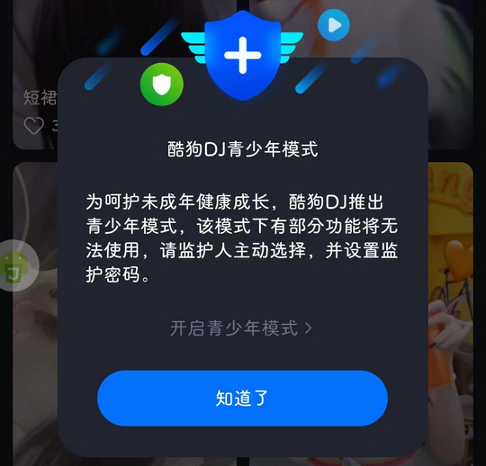

# com.kugou.dj（酷狗DJ）

## 普通规则

快速复制:
```
{"popup_rules":
    [
        {"id":"青少年模式","action":"知道了"}
    ]
}
```
详细说明：
- [{"id":"青少年模式","action":"知道了"}](#id青少年模式action知道了)

### {"id":"青少年模式","action":"知道了"}
关闭青少年模式




## 增强规则
