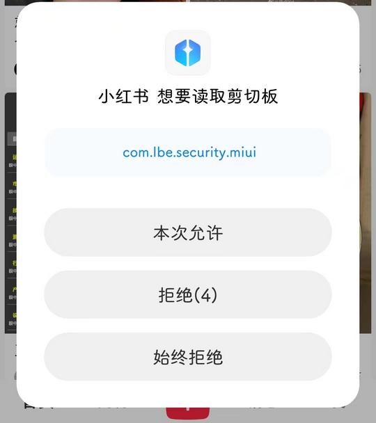

# com.lbe.security.miui（MIUI 权限管理服务）

## 普通规则

快速复制:
```
{"popup_rules":
    [
        {"id":"想要读取剪切板","action":"始终拒绝"}
    ]
}
```
详细说明：
- [{"id":"想要读取剪切板","action":"始终拒绝"}](#id想要读取剪切板action始终拒绝)

### {"id":"想要读取剪切板","action":"始终拒绝"}
去除 app 读取剪切板授权弹窗，自动点击 “始终拒绝”（⚠触发不稳定）



## 增强规则
