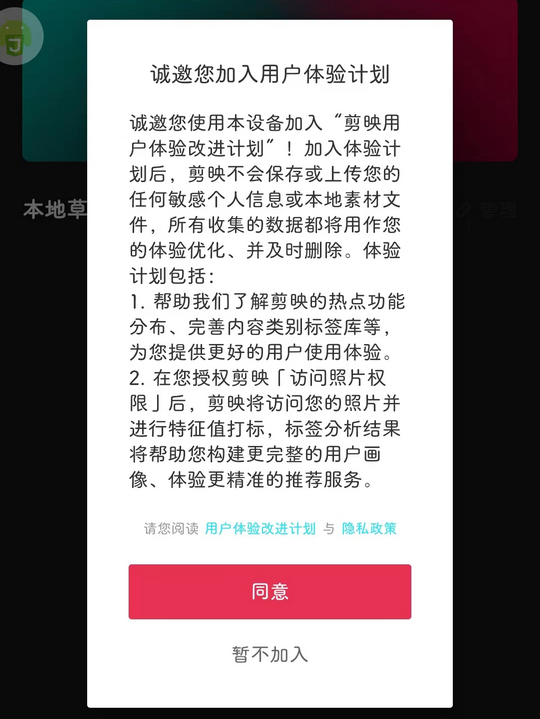
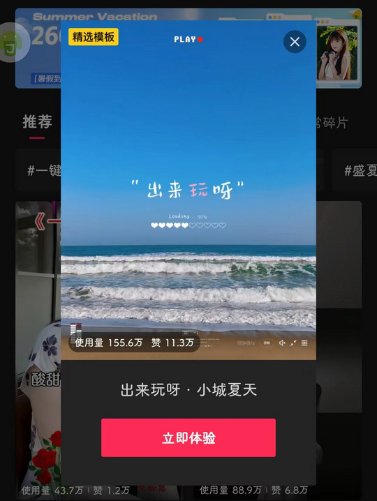

# com.lemon.lv（剪映）

## 基础规则

快速复制:
```
{"popup_rules":
    [
        {"id":"ux_program_title","action":"confirm_cancel"},
        {"id":"GuideModalConfirmBtn","action":"GLOBAL_ACTION_BACK"},
        {"id":"开启通知","action":"close"}
    ]
}
```
详细说明：
- [{"id":"ux_program_title","action":"confirm_cancel"}](#idux_program_titleactionconfirm_cancel)
- [{"id":"GuideModalConfirmBtn","action":"GLOBAL_ACTION_BACK"}](#idguidemodalconfirmbtnactionglobal_action_back)
- [{"id":"开启通知","action":"close"}](#id开启通知actionclose)

### {"id":"ux_program_title","action":"confirm_cancel"}
去除加入用户体验计划弹窗



### {"id":"GuideModalConfirmBtn","action":"GLOBAL_ACTION_BACK"}
去除 “剪同款” 页面模板弹窗



### {"id":"开启通知","action":"close"}
去除 “消息” 页面开启通知信息提示


## 增强规则
