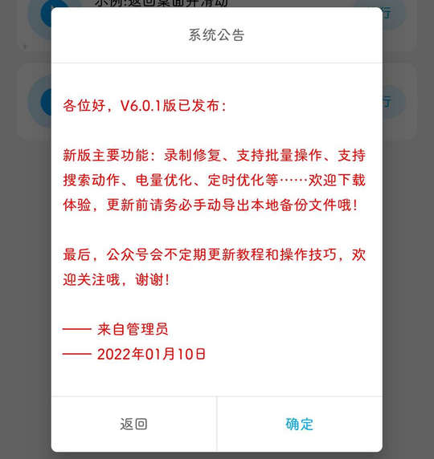

# com.lmiot.autotool（免ROOT自动化助手）

## 基础规则

快速复制:
```
{"popup_rules":
    [
        {"id":"系统公告","action":"确定"}
    ]
}
```
详细说明：
- [{"id":"系统公告","action":"确定"}](#id系统公告action确定)

### {"id":"系统公告","action":"确定"}
关闭系统公告弹窗




## 增强规则
