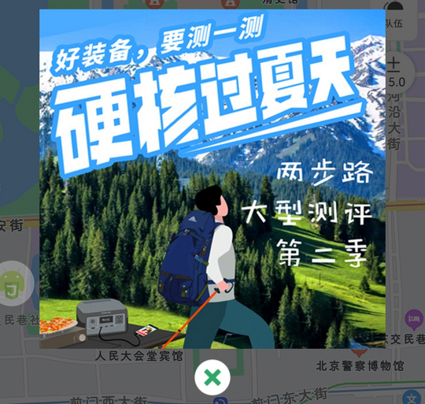

# com.lolaage.tbulu.tools（两步路户外助手）

## 基础规则

快速复制:
```
{"popup_rules":
    [
        {"id":"显示通知","action":"取消授权"},
        {"id":"ivAdv","action":"ivClose"}
    ]
}
```
详细说明：
- [{"id":"显示通知","action":"取消授权"}](#id显示通知action取消授权)
- [{"id":"ivAdv","action":"ivClose"}](#idivadvactionivclose)

### {"id":"显示通知","action":"取消授权"}
关闭 “发现” 页面弹窗广告


### {"id":"ivAdv","action":"ivClose"}
关闭地图页面广告弹窗



## 增强规则
