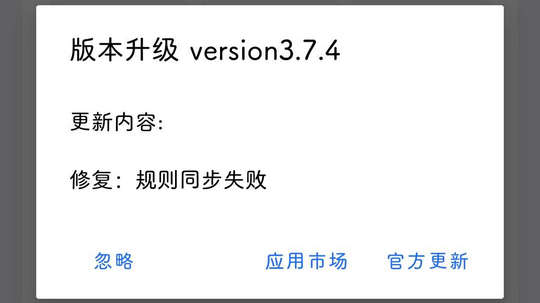

# com.magicalstory.cleaner（安卓清理君）

## 普通规则

快速复制:
```
{"popup_rules":
    [
        {"id":"版本升级","action":"忽略"}
    ]
}
```
详细说明：
- [{"id":"版本升级","action":"忽略"}](#id版本升级action忽略)

### {"id":"版本升级","action":"忽略"}
关闭更新弹窗




## 增强规则
