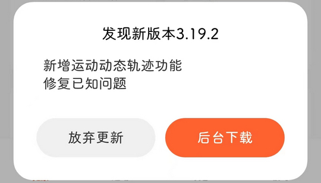

# com.mi.health（小米运动健康）

## 普通规则

快速复制:
```
{"popup_rules":
    [
        {"id":"发现新版本","action":"放弃更新"}
    ]
}
```
详细说明：
- [{"id":"发现新版本","action":"放弃更新"}](#id发现新版本action放弃更新)

### {"id":"发现新版本","action":"放弃更新"}
去除更新弹窗




## 增强规则
