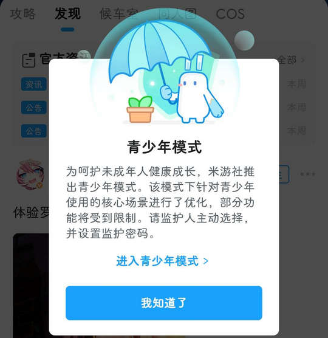

# com.mihoyo.hyperion（米游社）

## 基础规则

快速复制:
```
{"popup_rules":
    [
        {"id":"青少年模式","action":"我知道了"},
        {"id":"开启消息推送","action":"closeIv"}
    ]
}
```
详细说明：
- [{"id":"青少年模式","action":"我知道了"}](#id青少年模式action我知道了)
- [{"id":"开启消息推送","action":"closeIv"}](#id开启消息推送actioncloseiv)

### {"id":"青少年模式","action":"我知道了"}
关闭青少年模式弹窗



### {"id":"开启消息推送","action":"closeIv"}
关闭开启消息推送弹窗


## 增强规则
