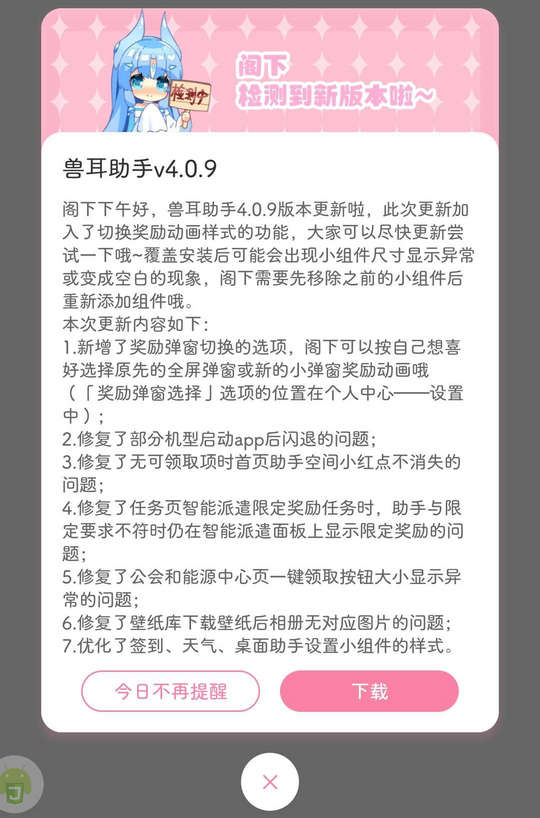

# com.mimikko.mimikkoui（兽耳助手）

## 基础规则

快速复制:
```
{"popup_rules":
    [
        {"id":"版本更新","action":"关闭"}
        {"id":"签到成功","action":"关闭"}
    ]
}
```
详细说明：
- [{"id":"版本更新","action":"关闭"}](#id版本更新action关闭)
- [{"id":"签到成功","action":"关闭"}](#id签到成功action关闭)

### {"id":"版本更新","action":"关闭"}
关闭更新弹窗



### {"id":"签到成功","action":"关闭"}
关闭签到成功弹窗


## 增强规则
