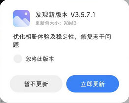

# com.miui.gallery（MIUI 相册）

## 基础规则

快速复制:
```
{"popup_rules":
    [
        {"id":"暂不更新","action":"update_title_tv"}
    ]
}
```
详细说明：
- [{"id":"暂不更新","action":"update_title_tv"}](#id暂不更新actionupdate_title_tv)

### {"id":"暂不更新","action":"update_title_tv"}
关闭更新弹窗




## 增强规则
