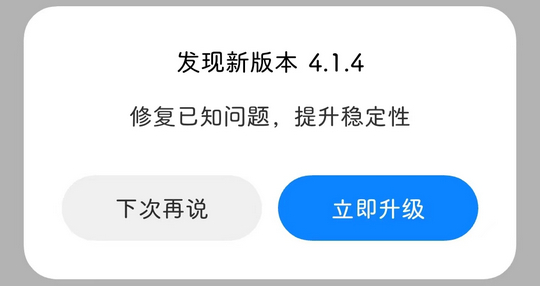

# im.com.miui.huanji（小米换机）

## 基础规则

快速复制:
```
{"popup_rules":
    [
        {"id":"发现新版本","action":"下次再说"}
    ]
}
```
详细说明：
- [{"id":"发现新版本","action":"下次再说"}](#id发现新版本action下次再说)

### {"id":"发现新版本","action":"下次再说"}
关闭更新弹窗




## 增强规则
