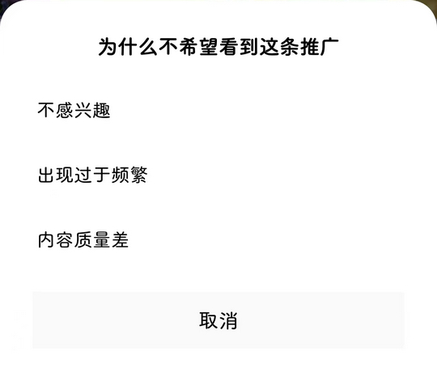

# com.miui.systemAdSolution（MIUI 智能服务）

## 普通规则

快速复制:
```
{"popup_rules":
    [
        {"id":"为什么不希望看到这条推广","action":"不感兴趣"}
    ]
}
```
详细说明：
- [{"id":"为什么不希望看到这条推广","action":"不感兴趣"}](#id为什么不希望看到这条推广action不感兴趣)

### {"id":"为什么不希望看到这条推广","action":"不感兴趣"}
关闭不希望看到这条推广理由选择弹窗，自动点击 “不感兴趣”

✔ 此规则需联合其他 MIUI 系应用生效，相关规则参见：
- [MIUI 主题壁纸](../../com.A/com.android.thememanager/readme.md#idad_titleactionad_close_btn)




## 增强规则
