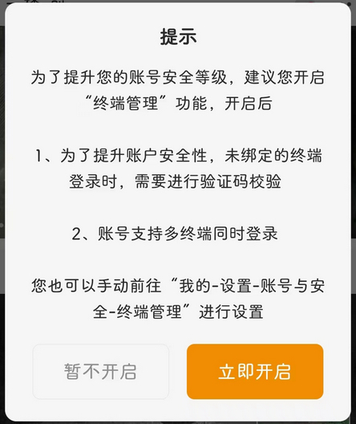

# com.mm.android.lc（乐橙）

## 基础规则

快速复制:
```
{"popup_rules":
    [
        {"id":"开启&终端管理","action":"暂不开启"}
    ]
}
```
详细说明：
- [{"id":"开启&终端管理","action":"暂不开启"}](#id开启终端管理action暂不开启)

### {"id":"开启&终端管理","action":"暂不开启"}
去除开启终端管理弹窗




## 增强规则
