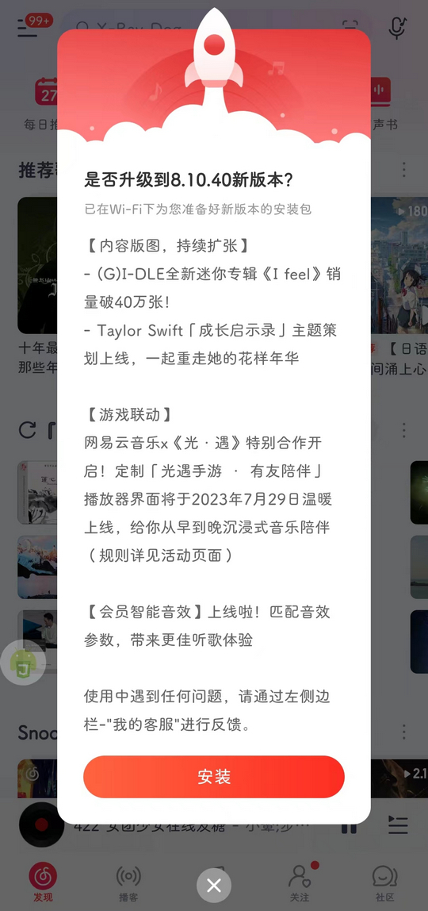

# com.netease.cloudmusic（网易云音乐）

## 基础规则

快速复制:
```
{"popup_rules":
    [
        {"id":"updateVersionTitle","action":"md_dialog_cm_close_btn"},
        {"id":"访问您的位置","action":"取消"}
    ]
}
```
详细说明：
- [{"id":"updateVersionTitle","action":"md_dialog_cm_close_btn"}](#idupdateversiontitleactionmd_dialog_cm_close_btn)
- [{"id":"访问您的位置","action":"取消"}](#id访问您的位置action取消)

### {"id":"updateVersionTitle","action":"md_dialog_cm_close_btn"}
关闭更新弹窗



### {"id":"访问您的位置","action":"取消"}
关闭访问位置弹窗


## 增强规则