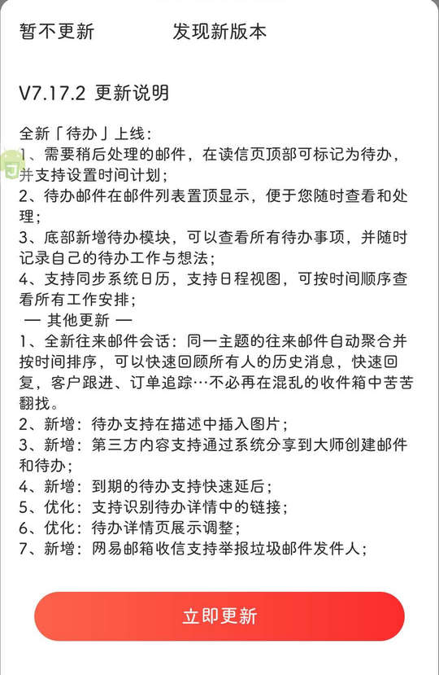

# com.netease.mail（网易邮箱大师）

## 基础规则

快速复制:
```
{"popup_rules":
    [
        {"id":"发现新版本","action":"tv_ignore_this_version"},
        {"id":"开启系统日历的访问权限","action":"取消"}
    ]
}
```
详细说明：
- [{"id":"发现新版本","action":"tv_ignore_this_version"}](#id发现新版本actiontv_ignore_this_version)
- [{"id":"开启系统日历的访问权限","action":"取消"}](#id开启系统日历的访问权限action取消)

### {"id":"发现新版本","action":"tv_ignore_this_version"}
关闭更新弹窗



### {"id":"开启系统日历的访问权限","action":"取消"}
关闭开启日历访问权限弹窗


## 增强规则
