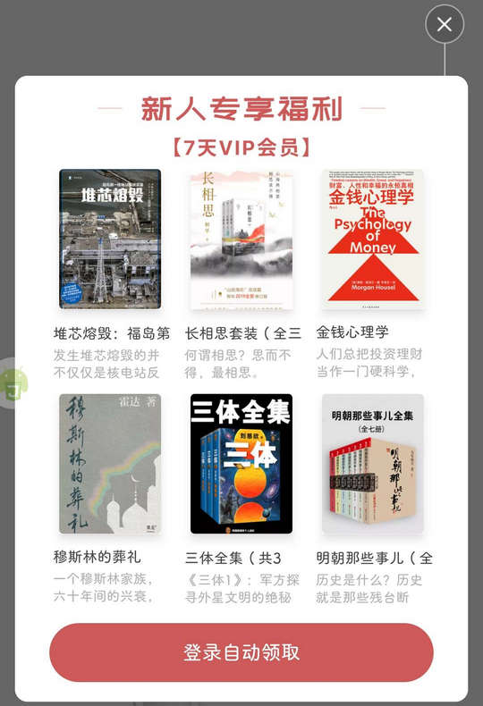

# com.netease.snailread（网易蜗牛读书）

## 基础规则

快速复制:
```
{"popup_rules":
    [
        {"id":"ll_book_recommend","action":"gift_close"},
        {"id":"gift_container","action":"gift_close"},
        {"id":"daily_container","action":"daily_close"}
    ]
}
```
详细说明：
- [{"id":"ll_book_recommend","action":"gift_close"}](#idll_book_recommendactiongift_close)
- [{"id":"gift_container","action":"gift_close"}](#idgift_containeractiongift_close)
- [{"id":"daily_container","action":"daily_close"}](#iddaily_containeractiondaily_close)

### {"id":"ll_book_recommend","action":"gift_close"}
关闭新人专享福利弹窗-1



### {"id":"gift_container","action":"gift_close"}
关闭新人专享福利弹窗-2


### {"id":"daily_container","action":"daily_close"}
关闭活动弹窗


## 增强规则
