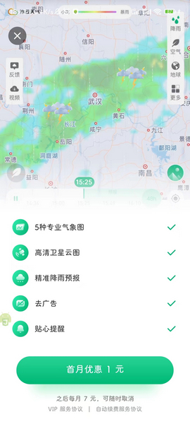

# com.nowcasting.activity（彩云天气）

## 普通规则

快速复制:
```
{"popup_rules":
    [
        {"id":"pay_vip_bt","action":"close_bt"},
        {"id":"new_user_promotion_card","action":"icon_close_button"},
        {"id":"完善资料领&VIP","action":"iv_close"}
    ]
}
```
详细说明：
- [{"id":"pay_vip_bt","action":"close_bt"}](#idpay_vip_btactionclose_bt)
- [{"id":"new_user_promotion_card","action":"icon_close_button"}](#idnew_user_promotion_cardactionicon_close_button)
- [{"id":"完善资料领&VIP","action":"iv_close"}](#id完善资料领vipactioniv_close)

### {"id":"pay_vip_bt","action":"close_bt"}
去除 “VIP首月优惠” 弹窗



### {"id":"new_user_promotion_card","action":"icon_close_button"}
去除 SVIP 限时特价广告


### {"id":"完善资料领&VIP","action":"iv_close"}
去除完善资料领 VIP 弹窗


## 增强规则
