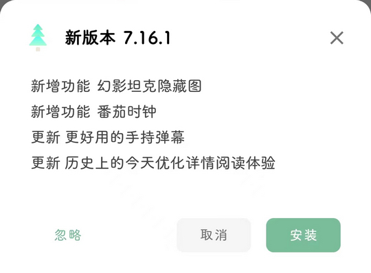

# com.One.WoodenLetter（一个木函）

## 普通规则

快速复制:
```
{"popup_rules":
    [
        {"id":"新版本","action":"忽略"}
    ]
}
```
详细说明：
- [{"id":"新版本","action":"忽略"}](#id新版本action忽略)

### {"id":"新版本","action":"忽略"}
去除更新弹窗




## 增强规则
