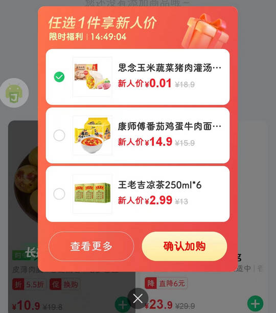

# com.pupumall.customer（朴朴超市）

## 基础规则

快速复制:
```
{"popup_rules":
    [
        {"id":"确认加购","action":"GLOBAL_ACTION_BACK"}
    ]
}
```
详细说明：
- [{"id":"确认加购","action":"GLOBAL_ACTION_BACK"}](#id确认加购actionglobal_action_back)

### {"id":"确认加购","action":"GLOBAL_ACTION_BACK"}
去除 “限时加购” 弹窗



## 增强规则
