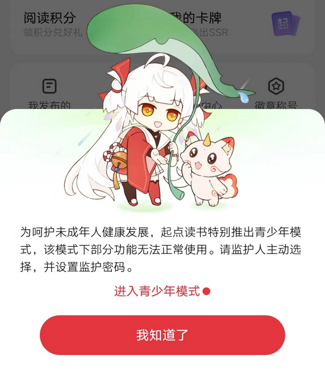
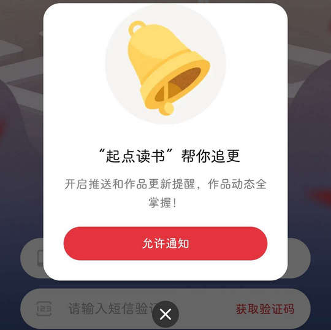
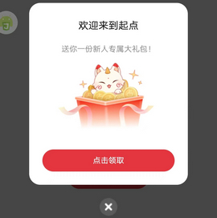
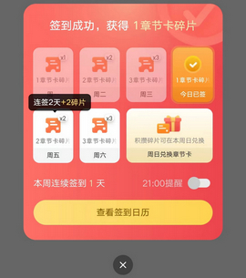
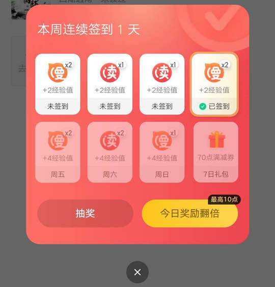

# com.qidian.QDReader（起点读书）

## 基础规则

快速复制:
```
{"popup_rules":
    [
        {"id":"青少年模式","action":"我知道了"},
        {"id":"开启推送","action":"closeBtn"},
        {"id":"新人专属大礼包","action":"ivClose"},
        {"id":"参加新人活动&免费领点币","action":"ivClose"},
        {"id":"ivAd","action":"ivAdClose"},
        {"id":"imgBKT","action":"imgClose"},
        {"id":"开启推送","action":"ivClose"},
        {"id":"签到成功&获得&章节卡碎片","action":"fClose"},
        {"id":"签到&天","action":"fClose"},
        {"id":"newAudioDialogTvTitle","action":"newAudioDialogNoPicCloseBtn"}
    ]
}
```
详细说明：
- [{"id":"青少年模式","action":"我知道了"}](#id青少年模式action我知道了)
- [{"id":"开启推送","action":"closeBtn"}](#id开启推送actionclosebtn)
- [{"id":"新人专属大礼包","action":"ivClose"}](#id新人专属大礼包actionivclose)
- [{"id":"参加新人活动&免费领点币","action":"ivClose"}](#id参加新人活动免费领点币actionivclose)
- [{"id":"ivAd","action":"ivAdClose"}](#idivadactionivadclose)
- [{"id":"imgBKT","action":"imgClose"}](#idimgbktactionimgclose)
- [{"id":"开启推送","action":"ivClose"}](#id开启推送actionivclose)
- [{"id":"签到成功&获得&章节卡碎片","action":"fClose"}](#id签到成功获得章节卡碎片actionfclose)
- [{"id":"签到&天","action":"fClose"}](#id签到天actionfclose)
- [{"id":"newAudioDialogTvTitle","action":"newAudioDialogNoPicCloseBtn"}](#idnewaudiodialogtvtitleactionnewaudiodialognopicclosebtn)

### {"id":"青少年模式","action":"我知道了"}
关闭青少年模式



### {"id":"开启推送","action":"closeBtn"}
关闭开启推送弹窗



### {"id":"新人专属大礼包","action":"ivClose"}
关闭新人专属大礼包弹窗



### {"id":"参加新人活动&免费领点币","action":"ivClose"}
关闭参加新人活动弹窗


### {"id":"ivAd","action":"ivAdClose"}
关闭 “书架” 页面右侧悬浮广告


### {"id":"imgBKT","action":"imgClose"}
关闭 “发现” 页面弹窗广告


### {"id":"开启推送","action":"ivClose"}
关闭开启推送提示信息


### {"id":"签到成功&获得&章节卡碎片","action":"fClose"}
关闭签到成功弹窗1



### {"id":"签到&天","action":"fClose"}
关闭签到成功弹窗2



### {"id":"newAudioDialogTvTitle","action":"newAudioDialogNoPicCloseBtn"}
关闭赠送会员弹窗


## 增强规则
