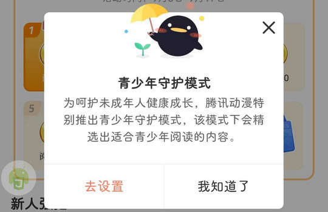

# com.qq.ac.android（腾讯动漫）

## 基础规则

快速复制:
```
{"popup_rules":
    [
        {"id":"青少年守护模式","action":"我知道了"},
        {"id":"head_img","action":"close"},
        {"id":"tv_name","action":"iv_del"}
    ]
}
```
详细说明：
- [{"id":"青少年守护模式","action":"我知道了"}](#id青少年守护模式action我知道了)
- [{"id":"head_img","action":"close"}](#idhead_imgactionclose)
- [{"id":"tv_name","action":"iv_del"}](#idtv_nameactioniv_del)

### {"id":"青少年守护模式","action":"我知道了"}
关闭青少年模式弹窗



### {"id":"head_img","action":"close"}
关闭萌新限时福利弹窗


### {"id":"tv_name","action":"iv_del"}
关闭章节阅读完成后的广告


## 增强规则
