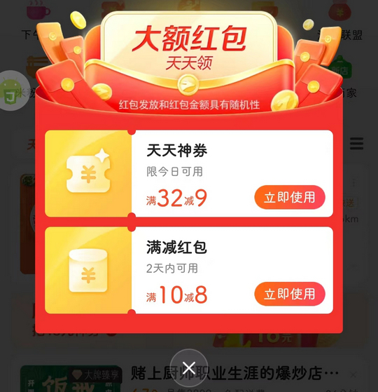
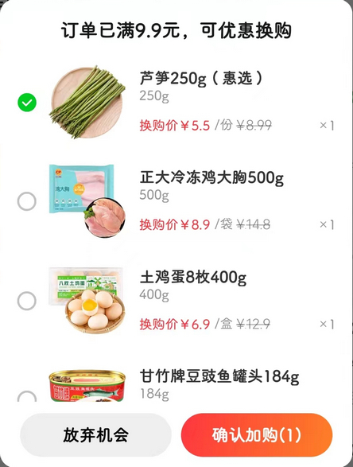
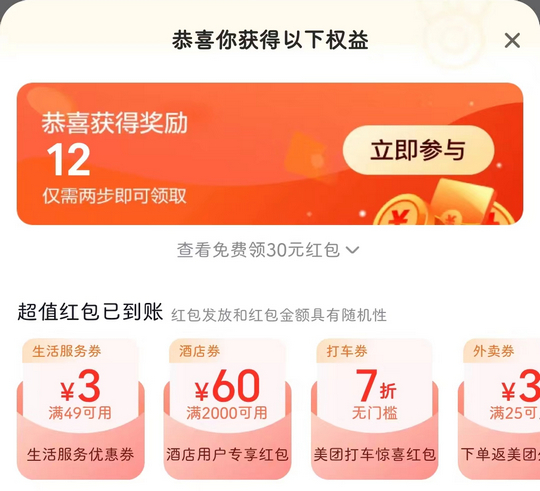

# com.sankuai.meituan（美团）

## 普通规则

快速复制:
```
{"popup_rules":
    [
        {"id":"bottom_center_close_button","action":"bottom_center_close_button"},
        {"id":"订单已满&优惠换购","action":"放弃机会"},
        {"id":"恭喜你获得以下权益","action":"GLOBAL_ACTION_BACK"}
    ]
}
```
详细说明：
- [{"id":"bottom_center_close_button","action":"bottom_center_close_button"}](#idbottom_center_close_buttonactionbottom_center_close_button)
- [{"id":"订单已满&优惠换购","action":"放弃机会"}](#id订单已满优惠换购action放弃机会)
- [{"id":"恭喜你获得以下权益","action":"GLOBAL_ACTION_BACK"}](#id恭喜你获得以下权益actionglobal_action_back)

### {"id":"bottom_center_close_button","action":"bottom_center_close_button"}
去除外卖页面红包弹窗



### {"id":"订单已满&优惠换购","action":"放弃机会"}
去除提交订单后弹出的 “优惠换购” 弹窗



### {"id":"恭喜你获得以下权益","action":"GLOBAL_ACTION_BACK"}

去除支付成功后弹出的 “领红包” 弹窗



## 增强规则
