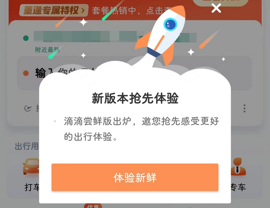
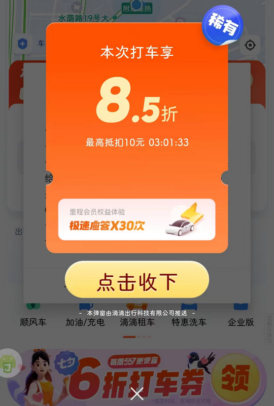
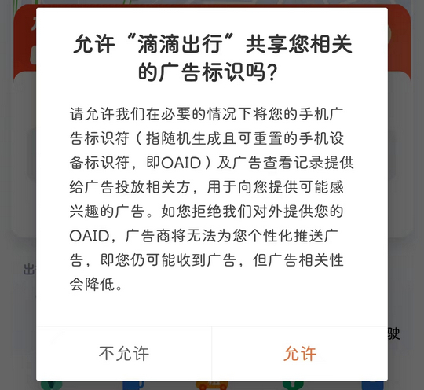

# com.sdu.didi.psnger（滴滴出行）

## 普通规则

快速复制:
```
{"popup_rules":
    [
        {"id":"tv_upgrade_title","action":"iv_upgrade_btn_ignore"},
        {"id":"广告弹窗","action":"关闭弹窗"},
        {"id":"共享&广告标识","action":"不允许"},
        {"id":"开启通知提醒","action":"im_feed_tip_close"}
    ]
}
```
详细说明：
- [{"id":"tv_upgrade_title","action":"iv_upgrade_btn_ignore"}](#idtv_upgrade_titleactioniv_upgrade_btn_ignore)
- [{"id":"广告弹窗","action":"关闭弹窗"}](#id广告弹窗action关闭弹窗)
- [{"id":"共享&广告标识","action":"不允许"}](#id共享广告标识action不允许)
- [{"id":"开启通知提醒","action":"im_feed_tip_close"}](#id开启通知提醒actionim_feed_tip_close)

### {"id":"tv_upgrade_title","action":"iv_upgrade_btn_ignore"}
关闭更新弹窗



### {"id":"广告弹窗","action":"关闭弹窗"}
关闭广告弹窗



### {"id":"共享&广告标识","action":"不允许"}
关闭共享广告标识弹窗



### {"id":"开启通知提醒","action":"im_feed_tip_close"}
关闭开启通知提醒提示信息


## 增强规则
