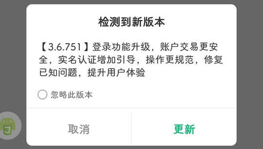

# com.sgcc.evs.echarge（e充电）

## 基础规则

快速复制:
```
{"popup_rules":
    [
        {"id":"检测到新版本","action":"取消"},
        {"id":"banner_ad","action":"iv_ad_close"}
    ]
}
```
详细说明：
- [{"id":"检测到新版本","action":"取消"}](#id检测到新版本action取消)
- [{"id":"banner_ad","action":"iv_ad_close"}](#idbanner_adactioniv_ad_close)

### {"id":"检测到新版本","action":"取消"}
关闭更新弹窗



### {"id":"banner_ad","action":"iv_ad_close"}
关闭“我的”页面banner广告


## 增强规则
