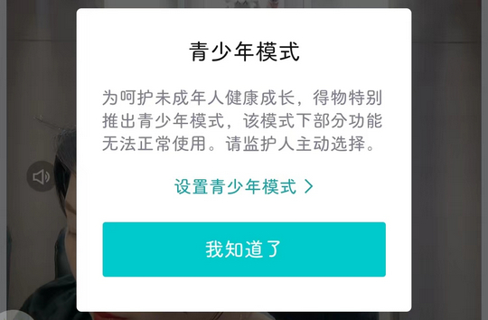
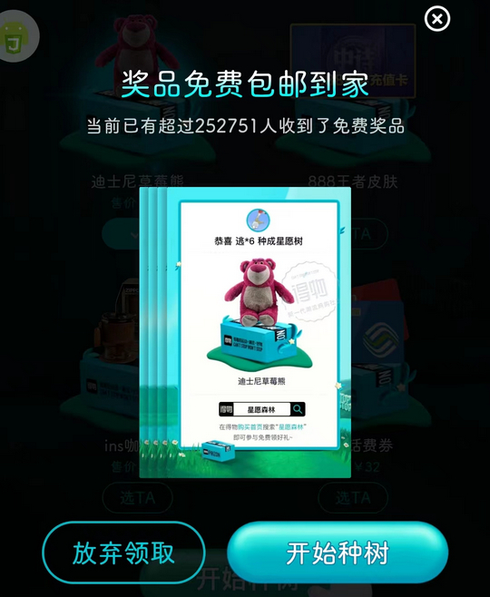
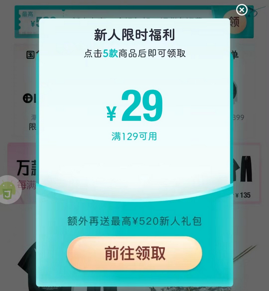

# com.shizhuang.duapp（得物）

## 基础规则

快速复制:
```
{"popup_rules":
    [
        {"id":"发现新版本","action":"ivClose"},
        {"id":"青少年模式","action":"我知道了"},
        {"id":"tvBottomFloatViewDesc","action":"ivBottomFloatViewClose"},
        {"id":"奖品免费包邮到家","action":"放弃领取"},
        {"id":"你可能感兴趣的人","action":"ivRemove","times":5},
        {"id":"anim_view","action":"closeIcon"},
        {"id":"新人超值好物","action":"ivClose"},
        {"id":"新人限时福利","action":"ivClose"}
    ]
}
```
详细说明：
- [{"id":"发现新版本","action":"ivClose"}](#id发现新版本actionivclose)
- [{"id":"青少年模式","action":"我知道了"}](#id青少年模式action我知道了)
- [{"id":"tvBottomFloatViewDesc","action":"ivBottomFloatViewClose"}](#idtvbottomfloatviewdescactionivbottomfloatviewclose)
- [{"id":"奖品免费包邮到家","action":"放弃领取"}](#id奖品免费包邮到家action放弃领取)
- [{"id":"你可能感兴趣的人","action":"ivRemove","times":5}](#id你可能感兴趣的人actionivremovetimes5)
- [{"id":"anim_view","action":"closeIcon"}](#idanim_viewactioncloseicon)
- [{"id":"新人超值好物","action":"ivClose"}](#id新人超值好物actionivclose)
- [{"id":"新人限时福利","action":"ivClose"}](#id新人限时福利actionivclose)

### {"id":"发现新版本","action":"ivClose"}
关闭更新弹窗


### {"id":"青少年模式","action":"我知道了"}
关闭青少年模式弹窗



### {"id":"tvBottomFloatViewDesc","action":"ivBottomFloatViewClose"}
关闭首页底部专属优惠券弹窗


### {"id":"奖品免费包邮到家","action":"放弃领取"}
关闭 “奖品免费包邮到家” 弹窗



### {"id":"你可能感兴趣的人","action":"ivRemove","times":5}
关闭首页上方 “你可能感兴趣的人” 推荐信息


### {"id":"anim_view","action":"closeIcon"}
关闭新人见面礼弹窗


### {"id":"新人超值好物","action":"ivClose"}
关闭新人超值好物弹窗


### {"id":"新人限时福利","action":"ivClose"}
关闭新人限时福利弹窗



## 增强规则
