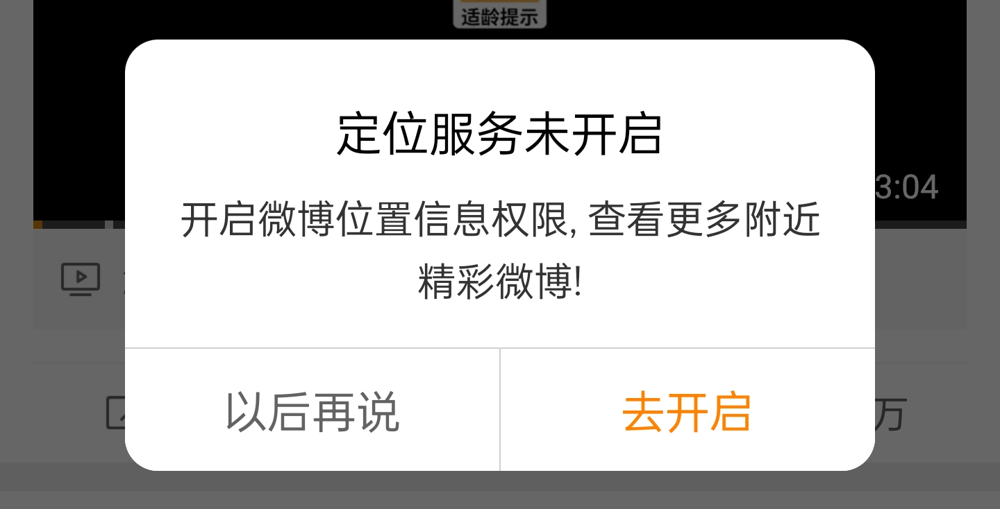
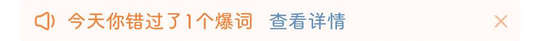

# com.sina.weibo（微博）

## 基础规则

快速复制:
```
{"popup_rules":
    [
        {"id":"打开通知，及时收到互动消息","action":"right_icon"},

        {"id":"选择通知类型","action":"暂不开启"},

        {"id":"bottom_process_tv","action":"close"},

        {"id":"使用您的位置信息","action":"以后再说"},

        {"id":"tv_tips","action":"iv_close_icon"},
        {"id":"不感兴趣&为何会看到此广告","action":"不感兴趣"},

        {"id":"tv_tips","action":"iv_close_icon"},
        {"id":"不感兴趣&屏蔽此博主","action":"不感兴趣"},

        {"id":"left_img_ad_tag","action":"close"},

        {"id":"关注你感兴趣的超话","action":"iv_close"},

        {"id":"定位服务未开启","action":"以后再说"},

        {"id":"点击签到","action":"GLOBAL_ACTION_BACK"},

        {"id":"给我们评分","action":"不了，谢谢"},

        {"id":"card_view","action":"right_top_tag"},

        {"id":"不感兴趣&内容质量差","action":"不感兴趣"},

        {"id":"错过了&爆词&查看详情","action":"mIvRight"}
    ]
}
```
详细说明：
- [{"id":"打开通知，及时收到互动消息","action":"right_icon"}](#id打开通知及时收到互动消息actionright_icon)
- [{"id":"选择通知类型","action":"暂不开启"}](#id选择通知类型action暂不开启)
- [{"id":"bottom_process_tv","action":"close"}](#idbottom_process_tvactionclose)
- [{"id":"使用您的位置信息","action":"以后再说"}](#id使用您的位置信息action以后再说)
- [{"id":"tv_tips","action":"iv_close_icon"} - {"id":"不感兴趣&为何会看到此广告","action":"不感兴趣"}](#idtv_tipsactioniv_close_icon---id不感兴趣为何会看到此广告action不感兴趣)
- [{"id":"tv_tips","action":"iv_close_icon"} - {"id":"不感兴趣&屏蔽此博主","action":"不感兴趣"}](#idtv_tipsactioniv_close_icon---id不感兴趣屏蔽此博主action不感兴趣)
- [{"id":"left_img_ad_tag","action":"close"}](#idleft_img_ad_tagactionclose)
- [{"id":"关注你感兴趣的超话","action":"iv_close"}](#id关注你感兴趣的超话actioniv_close)
- [{"id":"定位服务未开启","action":"以后再说"}](#id定位服务未开启action以后再说)
- [{"id":"点击签到","action":"GLOBAL_ACTION_BACK"}](#id点击签到actionglobal_action_back)
- [{"id":"给我们评分","action":"不了，谢谢"}](#id给我们评分action不了谢谢)
- [{"id":"card_view","action":"right_top_tag"}](#idcard_viewactionright_top_tag)
- [{"id":"错过了&爆词&查看详情","action":"mIvRight"}](#id错过了爆词查看详情actionmivright)

### {"id":"打开通知，及时收到互动消息","action":"right_icon"}
关闭打开通知提示信息


### {"id":"选择通知类型","action":"暂不开启"}
关闭选择通知类型弹窗


### {"id":"bottom_process_tv","action":"close"}
关闭 “首页” 页面 “刷微博领现金” 悬浮控件


### {"id":"使用您的位置信息","action":"以后再说"}
关闭 “使用位置信息” 弹窗


### {"id":"tv_tips","action":"iv_close_icon"} - {"id":"不感兴趣&为何会看到此广告","action":"不感兴趣"}
**联合规则**：关闭评论区广告

⚡ 需要手动触发


### {"id":"tv_tips","action":"iv_close_icon"} - {"id":"不感兴趣&屏蔽此博主","action":"不感兴趣"}
**联合规则**：关闭评论区推荐博主


### {"id":"left_img_ad_tag","action":"close"}
关闭微博正文下方广告


### {"id":"关注你感兴趣的超话","action":"iv_close"}
关闭关注感兴趣超话提示信息

⚡ 需要手动触发


### {"id":"定位服务未开启","action":"以后再说"}
关闭定位服务未开启弹窗



### {"id":"点击签到","action":"GLOBAL_ACTION_BACK"}
关闭签到弹窗


### {"id":"给我们评分","action":"不了，谢谢"}
关闭评分弹窗


### {"id":"card_view","action":"right_top_tag"}
关闭博文下方广告


### {"id":"不感兴趣&内容质量差","action":"不感兴趣"}
关闭推荐微博内容

⚡ 需要手动触发


### {"id":"错过了&爆词&查看详情","action":"mIvRight"}
关闭错过爆词提示信息



## 增强规则
