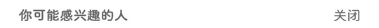

# com.smile.gifmaker（快手）

## 普通规则

快速复制:
```
{"popup_rules":
    [
        {"id":"reminder_push_guide_tv","action":"reminder_push_guide_close"},
        {"id":"你可能感兴趣的人","action":"关闭"}
    ]
}
```
详细说明：
- [{"id":"reminder_push_guide_tv","action":"reminder_push_guide_close"}](#idreminder_push_guide_tvactionreminder_push_guide_close)
- [{"id":"你可能感兴趣的人","action":"关闭"}](#id你可能感兴趣的人action关闭)


### {"id":"reminder_push_guide_tv","action":"reminder_push_guide_close"}
去除打开关注通知提示信息


### {"id":"你可能感兴趣的人","action":"关闭"}
去除首页你可能感兴趣的人




## 增强规则
