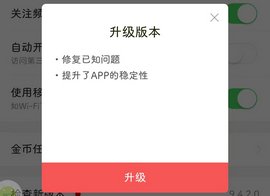
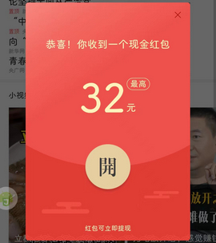

# com.ss.android.article.lite（今日头条极速版）

## 基础规则

快速复制:
```
{"popup_rules":
    [
        {"id":"升级版本","action":"关闭"},
        {"id":"收到一个现金红包","action":"关闭"}
    ]
}
```
详细说明：

- [{"id":"升级版本","action":"关闭"}]()
- [{"id":"收到一个现金红包","action":"关闭"}](#id收到一个现金红包action关闭)

### {"id":"升级版本","action":"关闭"}
去除更新弹窗



### {"id":"收到一个现金红包","action":"关闭"}
去除红包弹窗




## 增强规则
