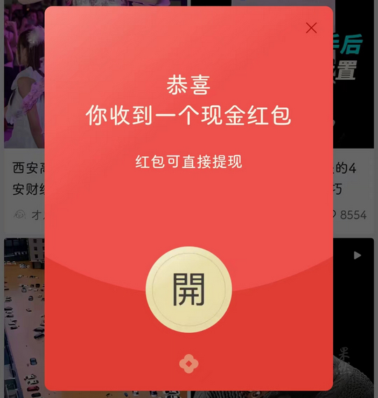
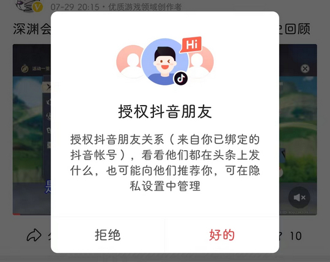

# com.ss.android.article.news（今日头条）

## 普通规则

快速复制:
```
{"popup_rules":
    [
        {"id":"你收到一个现金红包","action":"blb"},
        {"id":"开启推送通知，及时获取互动消息","action":"关闭"},
        {"id":"授权抖音朋友","action":"拒绝"}
    ]
}
```
详细说明：
- [{"id":"你收到一个现金红包","action":"blb"}](#id你收到一个现金红包actionblb)
- [{"id":"开启推送通知，及时获取互动消息","action":"关闭"}](#id开启推送通知及时获取互动消息action关闭)
- [{"id":"授权抖音朋友","action":"拒绝"}](#id授权抖音朋友action拒绝)

### {"id":"你收到一个现金红包","action":"blb"}
去除首页现金红包弹窗



### {"id":"开启推送通知，及时获取互动消息","action":"关闭"}
去除 “我的” 页面上方开启推送通知信息提示


### {"id":"授权抖音朋友","action":"拒绝"}
去除授权抖音朋友弹窗



## 增强规则
