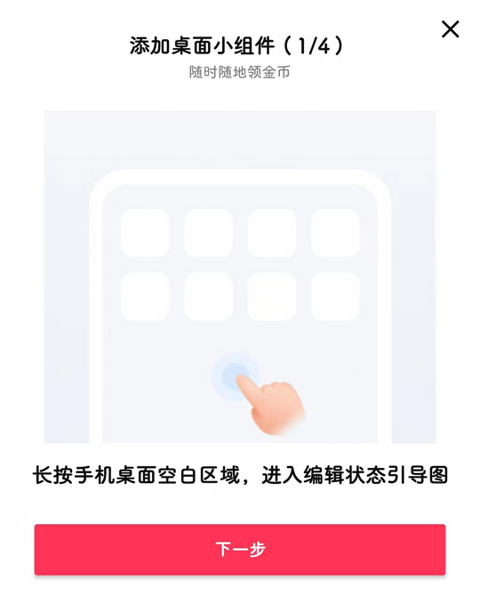

# com.ss.android.article.video（西瓜视频）

## 基础规则

快速复制:
```
{"popup_rules":
    [
        {"id":"red_packet_content","action":"red_packet_close"},
        {"id":"bn_","action":"bs3"},
        {"id":"添加桌面小组件","action":"GLOBAL_ACTION_BACK"}
    ]
}
```
详细说明：
- [{"id":"red_packet_content","action":"red_packet_close"}](#idred_packet_contentactionred_packet_close)
- [{"id":"bn_","action":"bs3"}](#idbn_actionbs3)
- [{"id":"添加桌面小组件","action":"GLOBAL_ACTION_BACK"}](#id添加桌面小组件actionglobal_action_back)

### {"id":"red_packet_content","action":"red_packet_close"}
去除 “新人红包” 弹窗


### {"id":"bn_","action":"bs3"}
去除首页左侧悬浮广告


### {"id":"添加桌面小组件","action":"GLOBAL_ACTION_BACK"}
去除 “添加桌面小组件” 弹窗



## 增强规则
