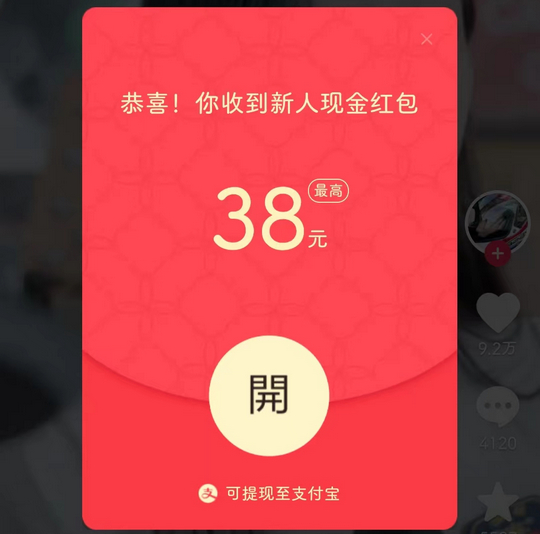
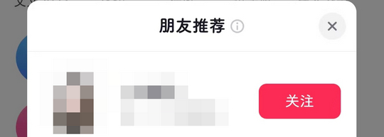
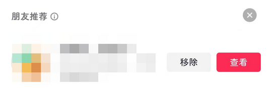
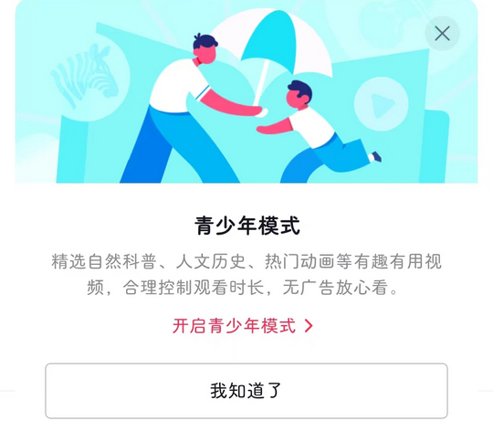
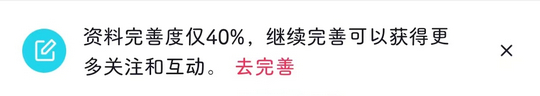

# com.ss.android.ugc.aweme.lite（抖音极速版）

## 基础规则

快速复制:
```
{"popup_rules":
    [
        {"id":"恭喜！你收到新人现金红包","action":"dtj"},
        {"id":"朋友推荐","action":"close"},
        {"id":"朋友推荐","action":"不感兴趣"},
        {"id":"朋友推荐","action":"关闭"},
        {"id":"青少年模式","action":"关闭"},
        {"id":"资料完善度&继续完善","action":"关闭"}
    ]
}
```
详细说明：
- [{"id":"恭喜！你收到新人现金红包","action":"dtj"}](#id恭喜你收到新人现金红包actiondtj)
- [{"id":"朋友推荐","action":"close"}](#id朋友推荐actionclose)
- [{"id":"朋友推荐","action":"不感兴趣"}](#id朋友推荐action不感兴趣)
- [{"id":"朋友推荐","action":"关闭"}](#id朋友推荐action关闭)
- [{"id":"青少年模式","action":"关闭"}](#id青少年模式action关闭)
- [{"id":"资料完善度&继续完善","action":"关闭"}](#id资料完善度继续完善action关闭)

### {"id":"恭喜！你收到新人现金红包","action":"dtj"}
去除首页红包弹窗



### {"id":"朋友推荐","action":"close"}
去除 “消息” 页面 “朋友推荐” 弹窗



### {"id":"朋友推荐","action":"不感兴趣"}
去除 “消息” 页面 “朋友推荐” 信息提示



### {"id":"朋友推荐","action":"关闭"}
去除 消息->新朋友 页面 “朋友推荐” 信息提示


### {"id":"青少年模式","action":"关闭"}
去除 “青少年模式” 弹窗



### {"id":"资料完善度&继续完善","action":"关闭"}
去除 “完善资料” 弹窗



## 增强规则
