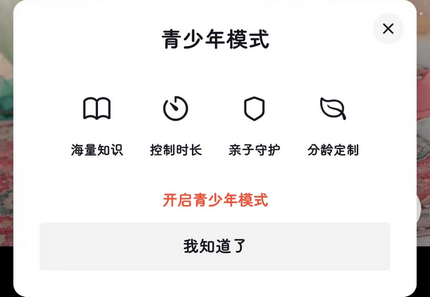
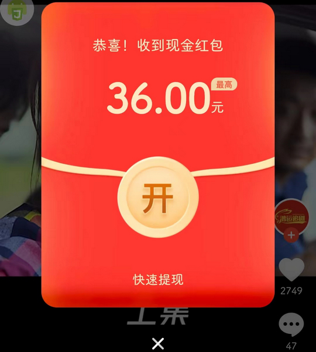
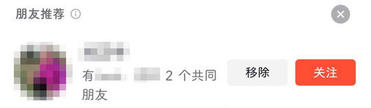

# com.ss.android.ugc.live（抖音火山版）

## 基础规则

快速复制:
```
{"popup_rules":
    [
        {"id":"检测到更新","action":"以后再说"},
        {"id":"青少年模式","action":"关闭"},
        {"id":"收到现金红包","action":"bci"},
        {"id":"授权提示","action":"我再想想"},
        {"id":"授权通讯录","action":"拒绝"},
        {"id":"资料完善度&继续完善","action":"关闭"},
        {"id":"朋友推荐","action":"关闭"},
        {"id":"简介支持@功能，快来试试吧","action":"关闭"}
    ]
}
```
详细说明：
- [{"id":"检测到更新","action":"以后再说"}](#id检测到更新action以后再说)
- [{"id":"青少年模式","action":"关闭"}](#id青少年模式action关闭)
- [{"id":"收到现金红包","action":"bci"}](#id收到现金红包actionbci)
- [{"id":"授权提示","action":"我再想想"}](#id授权提示action我再想想)
- [{"id":"授权通讯录","action":"拒绝"}](#id授权通讯录action拒绝)
- [{"id":"资料完善度&继续完善","action":"关闭"}](#id资料完善度继续完善action关闭)
- [{"id":"朋友推荐","action":"关闭"}](#id朋友推荐action关闭)
- [{"id":"简介支持@功能，快来试试吧","action":"关闭"}](#id简介支持功能快来试试吧action关闭)

### {"id":"检测到更新","action":"以后再说"}
关闭更新弹窗


### {"id":"青少年模式","action":"关闭"}
关闭青少年模式弹窗



### {"id":"收到现金红包","action":"bci"}
关闭现金红包弹窗



### {"id":"授权提示","action":"我再想想"}
关闭授权提示弹窗


### {"id":"授权通讯录","action":"拒绝"}
关闭授权通讯录弹窗


### {"id":"资料完善度&继续完善","action":"关闭"}
关闭完善资料提示信息


### {"id":"朋友推荐","action":"关闭"}
关闭朋友推荐



### {"id":"简介支持@功能，快来试试吧","action":"关闭"}
关闭 “简介支持@功能，快来试试吧” 弹窗


## 增强规则
