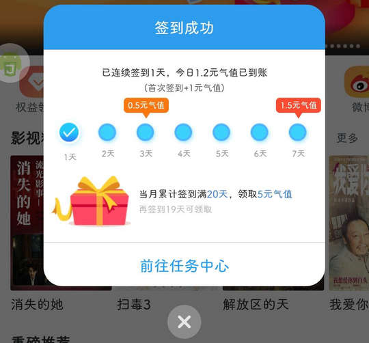

# com.telecom.video（天翼超高清）

## 普通规则

快速复制:
```
{"popup_rules":
    [
        {"id":"dialog_teenager_tv_tip","action":"dialog_teenager_tv_iKnow"},
        {"id":"newVipUser_tv_tip","action":"main_newVipUser_close"},
        {"id":"开通消息通知","action":"iv_close"},
        {"id":"签到成功","action":"iv_close"},
        {"id":"image_ad","action":"iv_close"}
    ]
}
```
详细说明：
- [{"id":"dialog_teenager_tv_tip","action":"dialog_teenager_tv_iKnow"}](#iddialog_teenager_tv_tipactiondialog_teenager_tv_iknow)
- [{"id":"newVipUser_tv_tip","action":"main_newVipUser_close"}](#idnewvipuser_tv_tipactionmain_newvipuser_close)
- [{"id":"开通消息通知","action":"iv_close"}](#id开通消息通知actioniv_close)
- [{"id":"签到成功","action":"iv_close"}](#id签到成功actioniv_close)
- [{"id":"image_ad","action":"iv_close"}](#idimage_adactioniv_close)

### {"id":"dialog_teenager_tv_tip","action":"dialog_teenager_tv_iKnow"}
关闭青少年模式弹窗


### {"id":"newVipUser_tv_tip","action":"main_newVipUser_close"}
关闭用户已加入会员提示


### {"id":"开通消息通知","action":"iv_close"}
关闭开启消息通知弹窗


### {"id":"签到成功","action":"iv_close"}
关闭签到成功弹窗



### {"id":"image_ad","action":"iv_close"}
关闭首页影视广告弹窗


## 增强规则
