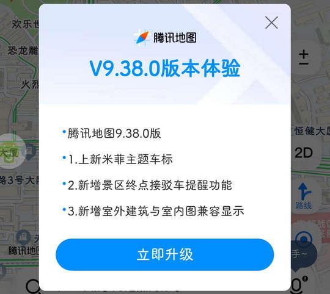
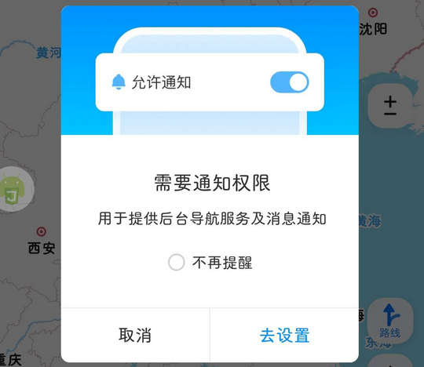

# com.tencent.map（腾讯地图）

## 基础规则

快速复制:
```
{"popup_rules":
    [
        {"id":"立即升级","action":"GLOBAL_ACTION_BACK"},
        {"id":"需要通知权限","action":"取消"},
        {"id":"关闭按钮","action":"关闭按钮"}
    ],
    "times":5
}
```
详细说明：
- [{"id":"立即升级","action":"GLOBAL_ACTION_BACK"}](#id立即升级actionglobal_action_back)
- [{"id":"需要通知权限","action":"取消"}](#id需要通知权限action取消)
- [{"id":"关闭按钮","action":"关闭按钮"}](#id关闭按钮action关闭按钮)

### {"id":"立即升级","action":"GLOBAL_ACTION_BACK"}
关闭更新弹窗



### {"id":"需要通知权限","action":"取消"}
关闭开启通知权限弹窗



### {"id":"关闭按钮","action":"关闭按钮"}
关闭推广信息


## 增强规则
