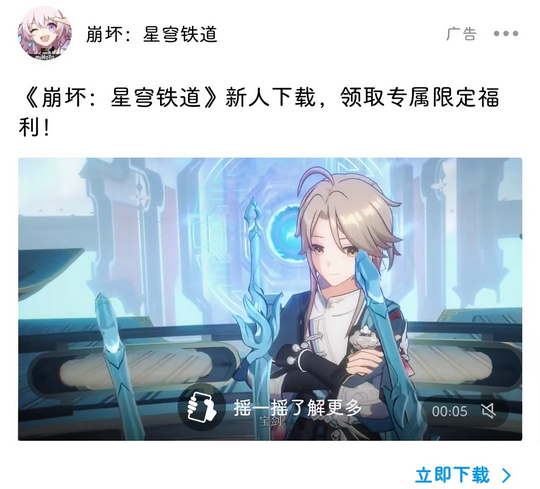

# com.tencent.mobileqq（QQ）

## 普通规则

快速复制:
```
{"popup_rules":
    [
        {"id":"lpk","action":"关闭"},
        {"id":"=广告","action":"=更多"},
        {"id":"=关闭此条广告","action":"=关闭此条广告"}
    ]
}
```
详细说明：
- [{"id":"lpk","action":"关闭"}](#idlpkaction关闭)
- [{"id":"=广告","action":"=更多"} - {"id":"=关闭此条广告","action":"=关闭此条广告"}](#id广告action更多---id关闭此条广告action关闭此条广告)

### {"id":"lpk","action":"关闭"}
去除 “消息” 页面上方广告


### {"id":"=广告","action":"=更多"} - {"id":"=关闭此条广告","action":"=关闭此条广告"}
**联合规则**: 去除好友动态页面广告推荐



## 增强规则
