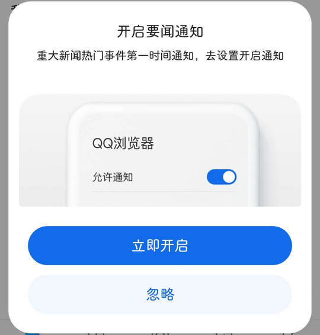

# com.tencent.mtt（QQ浏览器）

## 基础规则

快速复制:
```
{"popup_rules":
    [
        {"id":"vp_guide_add","action":"iv_close"},
        {"id":"开启要闻通知","action":"忽略"}
    ]
}
```
详细说明：
- [{"id":"vp_guide_add","action":"iv_close"}](#idvp_guide_addactioniv_close)
- [{"id":"开启要闻通知","action":"忽略"}](#id开启要闻通知action忽略)

### {"id":"vp_guide_add","action":"iv_close"}
关闭添加热门站点一键直达向导


### {"id":"开启要闻通知","action":"忽略"}
关闭开启要问通知弹窗




## 增强规则
