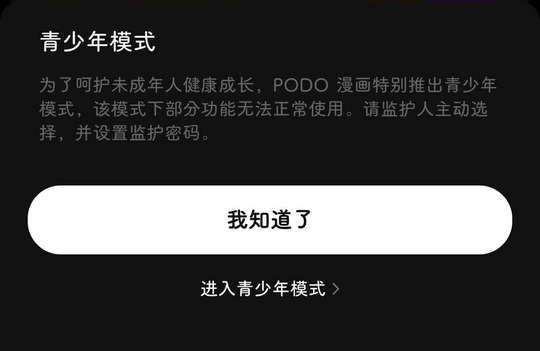

# com.tencent.podoteng（PODO漫画）

## 基础规则

快速复制:
```
{"popup_rules":
    [
        {"id":"青少年模式","action":"我知道了"},
        {"id":"新人福利","action":"close"},
        {"id":"打开推送提醒","action":"关闭"}
    ]
}
```
详细说明：
- [{"id":"青少年模式","action":"我知道了"}](#id青少年模式action我知道了)
- [{"id":"新人福利","action":"close"}](#id新人福利actionclose)
- [{"id":"打开推送提醒","action":"关闭"}](#id打开推送提醒action关闭)

### {"id":"青少年模式","action":"我知道了"}
关闭青少年模式弹窗



### {"id":"新人福利","action":"close"}
关闭新人福利弹窗


### {"id":"打开推送提醒","action":"关闭"}
关闭打开推送提醒弹窗


## 增强规则
