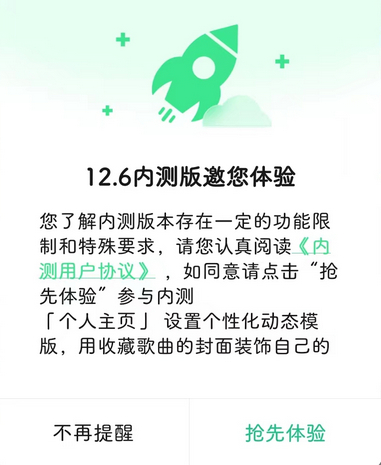
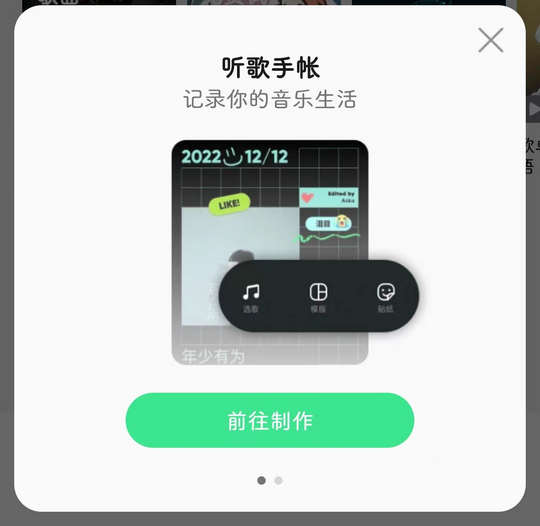

# com.tencent.qqmusic（QQ音乐）

## 基础规则

快速复制:
```
{"popup_rules":
    [
        {"id":"马上升级","action":"不再提醒"},
        {"id":"抢先体验&不再提醒","action":"不再提醒"},
        {"id":"关闭,按钮","action":"关闭,按钮"},
        {"id":"关闭新特性弹窗","action":"关闭新特性弹窗"},
        {"id":"关闭按钮","action":"关闭按钮"}
    ]
}
```
详细说明：
- [{"id":"马上升级","action":"不再提醒"}](#id马上升级action不再提醒)
- [{"id":"抢先体验&不再提醒","action":"不再提醒"}](#id抢先体验不再提醒action不再提醒)
- [{"id":"关闭,按钮","action":"关闭,按钮"}](#id关闭按钮action关闭按钮)
- [{"id":"关闭新特性弹窗","action":"关闭新特性弹窗"}](#id关闭新特性弹窗action关闭新特性弹窗)
- [{"id":"关闭按钮","action":"关闭按钮"}](#id关闭按钮action关闭按钮)

### {"id":"马上升级","action":"不再提醒"}
关闭更新弹窗


### {"id":"抢先体验&不再提醒","action":"不再提醒"}
关闭内测版本抢先体验弹窗



### {"id":"关闭,按钮","action":"关闭,按钮"}
关闭听书页面广告弹窗


### {"id":"关闭新特性弹窗","action":"关闭新特性弹窗"}
关闭新特性弹窗



### {"id":"关闭按钮","action":"关闭按钮"}
关闭关注公众号提示信息


## 增强规则