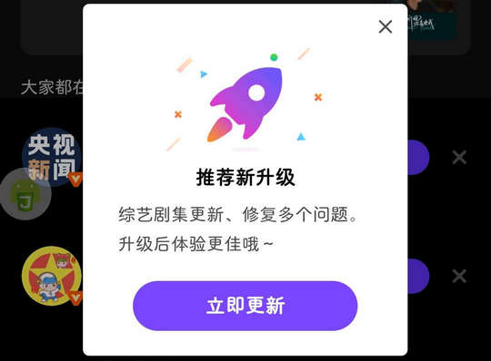
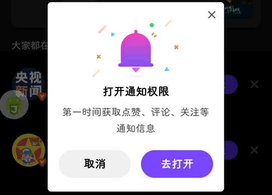
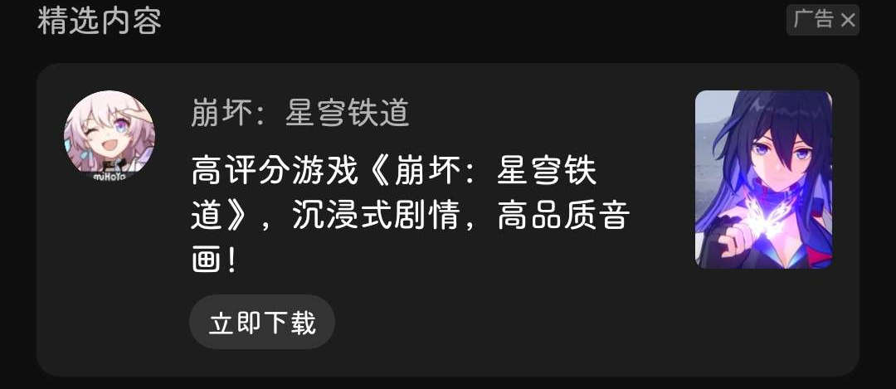

# com.tencent.weishi（微视）

⚠ 该 App 界面控件 ID 经过混淆，对其适配极其有限。

## 基础规则

快速复制:
```
{"popup_rules":
    [
        {"id":"立即更新","action":"GLOBAL_ACTION_BACK"},
        {"id":"打开通知权限","action":"取消"},
        {"id":"精选内容","action":"Close"}
    ]
}
```
详细说明：
- [{"id":"立即更新","action":"GLOBAL_ACTION_BACK"}](#id立即更新actionglobal_action_back)
- [{"id":"打开通知权限","action":"取消"}](#id打开通知权限action取消)
- [{"id":"精选内容","action":"Close"}](#id精选内容actionclose)

### {"id":"立即更新","action":"GLOBAL_ACTION_BACK"}
关闭更新弹窗



### {"id":"打开通知权限","action":"取消"}
关闭打开通知权限弹窗



### {"id":"精选内容","action":"Close"}
关闭精选内容



## 增强规则
