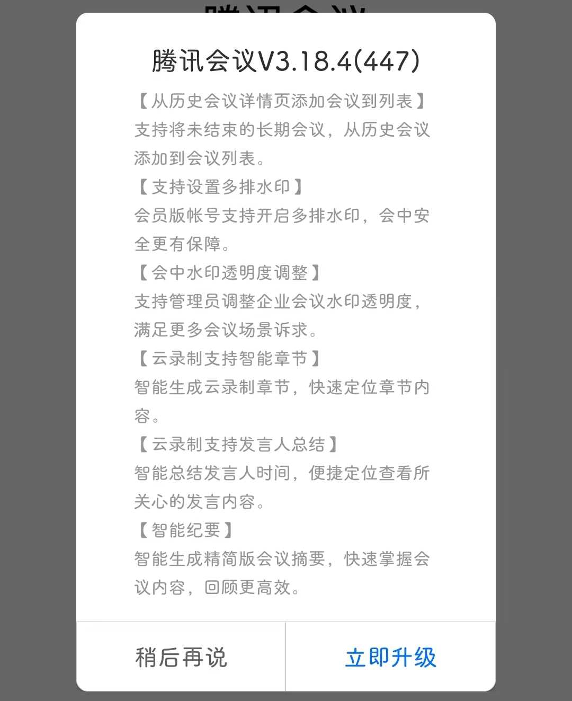

# com.tencent.wemeet.app（腾讯会议）

## 基础规则

快速复制:
```
{"popup_rules":
    [
        {"id":"立即升级","action":"稍后再说"},
        {"id":"bud","action":"bud"}
    ]
}
```
详细说明：
- [{"id":"立即升级","action":"稍后再说"}](#id立即升级action稍后再说)
- [{"id":"bud","action":"bud"}](#idbudactionbud)

### {"id":"立即升级","action":"稍后再说"}
去除更新弹窗



### {"id":"bud","action":"bud"}
去除 “腾讯会议调整说明” 提示信息


## 增强规则
