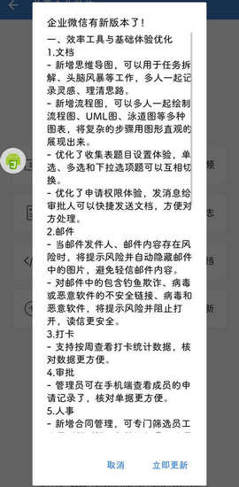

# com.tencent.wework（企业微信）

## 基础规则

快速复制:
```
{"popup_rules":
    [
        {"id":"有新版本","action":"取消"}
    ]
}
```
详细说明：
- [{"id":"有新版本","action":"取消"}](#id有新版本action取消)

### {"id":"有新版本","action":"取消"}
关闭更新弹窗




## 增强规则
