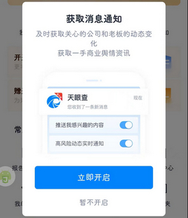

# com.tianyancha.skyeye（天眼查）

## 基础规则

快速复制:
```
{"popup_rules":
    [
        {"id":"获取消息通知","action":"暂不开启"}
    ]
}
```
详细说明：
- [{"id":"获取消息通知","action":"暂不开启"}](#id获取消息通知action暂不开启)

### {"id":"获取消息通知","action":"暂不开启"}
去除开启消息通知弹窗




## 增强规则
