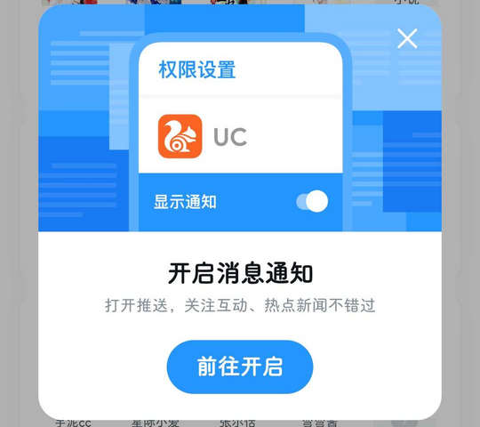

# com.UCMobile（UC浏览器）

⚠ 该 App 界面大多数控件均没有任何可标识的文本，对其适配极其有限。

## 基础规则

快速复制:
```
{"popup_rules":
    [
        {"id":"开启消息通知","action":"GLOBAL_ACTION_BACK"}
    ]
}
```
详细说明：
- [{"id":"开启消息通知","action":"GLOBAL_ACTION_BACK"}](#id开启消息通知actionglobal_action_back)

### {"id":"开启消息通知","action":"GLOBAL_ACTION_BACK"}
关闭开启消息通知弹窗




## 增强规则
