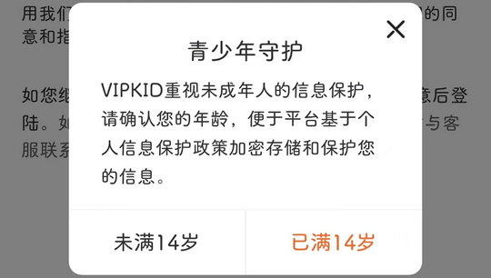
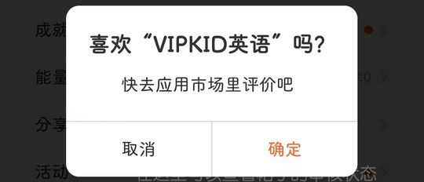

# com.vipkid.app（VIPKID英语）

## 基础规则

快速复制:
```
{"popup_rules":
    [
        {"id":"青少年守护","action":"已满14岁"},
        {"id":"cancelButton","action":"cancelButton"},
        {"id":"去&应用市场&评价","action":"取消"}
    ]
}
```
详细说明：
- [{"id":"青少年守护","action":"已满14岁"}](#id青少年守护action已满14岁)
- [{"id":"cancelButton","action":"cancelButton"}](#idcancelbuttonactioncancelbutton)
- [{"id":"去&应用市场&评价","action":"取消"}](#id去应用市场评价action取消)

### {"id":"青少年守护","action":"已满14岁"}
去除青少年模式弹窗



### {"id":"cancelButton","action":"cancelButton"}
去除免费领取试听课弹窗


### {"id":"去&应用市场&评价","action":"取消"}
去除应用市场评价弹窗



## 增强规则
