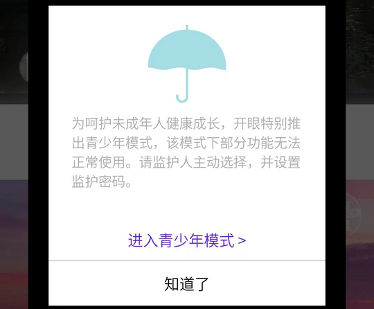

# com.wandoujia.eyepetizer（开眼）

## 基础规则

快速复制:
```
{"popup_rules":
    [
        {"id":"青少年模式","action":"知道了"}
    ]
}
```
详细说明：
- [{"id":"青少年模式","action":"知道了"}](#id青少年模式action知道了)

### {"id":"青少年模式","action":"知道了"}
去除更新弹窗



## 增强规则
