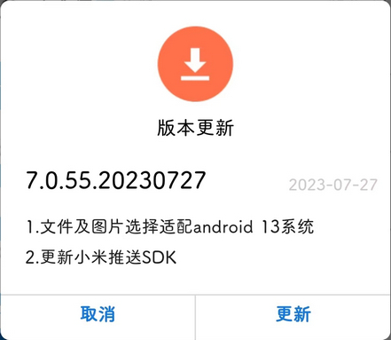

# com.weaver.emobile7（EMobile7）

## 基础规则

快速复制:
```
{"popup_rules":
    [
        {"id":"版本更新","action":"取消"}
    ]
}
```
详细说明：
- [{"id":"版本更新","action":"取消"}](#id版本更新action取消)

### {"id":"版本更新","action":"取消"}
去除更新弹窗




## 增强规则