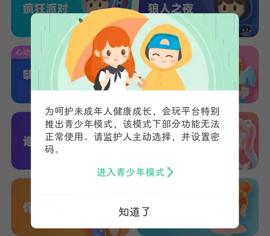
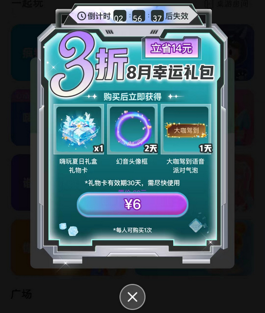

# com.wepie.weplay（会玩）

## 基础规则

快速复制:
```
{"popup_rules":
    [
        {"id":"青少年模式","action":"ok_tv"},
        {"id":"bg_iv","action":"close_iv"},
        {"id":"notification_open_lay","action":"close_lay_btn"}
    ]
}
```
详细说明：
- [{"id":"青少年模式","action":"ok_tv"}](#id青少年模式actionok_tv)
- [{"id":"bg_iv","action":"close_iv"}](#idbg_ivactionclose_iv)
- [{"id":"notification_open_lay","action":"close_lay_btn"}](#idnotification_open_layactionclose_lay_btn)

### {"id":"青少年模式","action":"ok_tv"}
去除青少年模式弹窗



### {"id":"bg_iv","action":"close_iv"}
去除首页悬浮广告



### {"id":"notification_open_lay","action":"close_lay_btn"}
去除 “消息” 页面上方打开通知权限信息提示


## 增强规则
