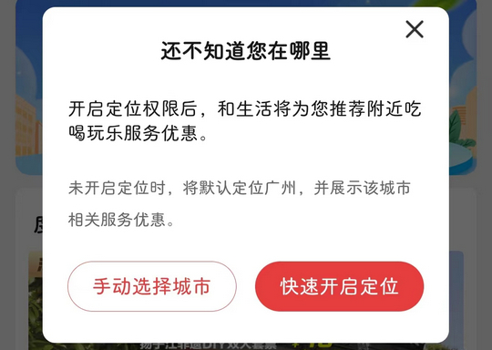
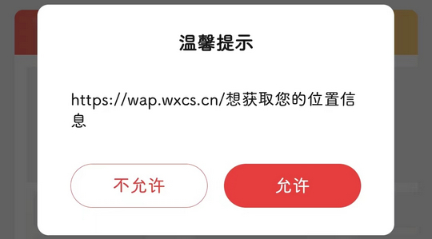

# com.whty.wicity.china（和生活）

## 基础规则

快速复制:
```
{"popup_rules":
    [
        {"id":"开启定位权限","action":"img_close"},
        {"id":"想获取您的位置信息","action":"不允许"}
    ]
}
```
详细说明：
- [{"id":"开启定位权限","action":"img_close"}](#id开启定位权限actionimg_close)
- [{"id":"想获取您的位置信息","action":"不允许"}](#id想获取您的位置信息action不允许)

### {"id":"开启定位权限","action":"img_close"}
关闭开启定位权限弹窗



### {"id":"想获取您的位置信息","action":"不允许"}
关闭“小移美食”页面开启定位权限弹窗




## 增强规则
