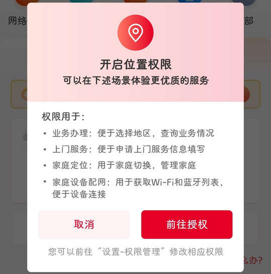

# com.woapp.hebei（联通智家）

## 基础规则

快速复制:
```
{"popup_rules":
    [
        {"id":"开启位置权限","action":"取消"}
    ]
}
```
详细说明：
- [{"id":"开启位置权限","action":"取消"}](#id开启位置权限action取消)

### {"id":"开启位置权限","action":"取消"}
关闭开启定位权限弹窗




## 增强规则
