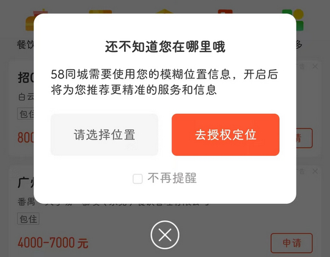

# com.wuba（58同城）

## 基础规则

快速复制:
```
{"popup_rules":
    [
        {"id":"tv_authorize_dlg_title","action":"btn_close_auth_dlg"},
        {"id":"tv_location_title","action":"iv_location_close"}
    ]
}
```
详细说明：
- [{"id":"tv_authorize_dlg_title","action":"btn_close_auth_dlg"}](#idtv_authorize_dlg_titleactionbtn_close_auth_dlg)
- [{"id":"tv_location_title","action":"iv_location_close"}](#idtv_location_titleactioniv_location_close)

### {"id":"tv_authorize_dlg_title","action":"btn_close_auth_dlg"}
去除授权定位弹窗



### {"id":"tv_location_title","action":"iv_location_close"}
去除首页上方授权定位信息提示


## 增强规则
